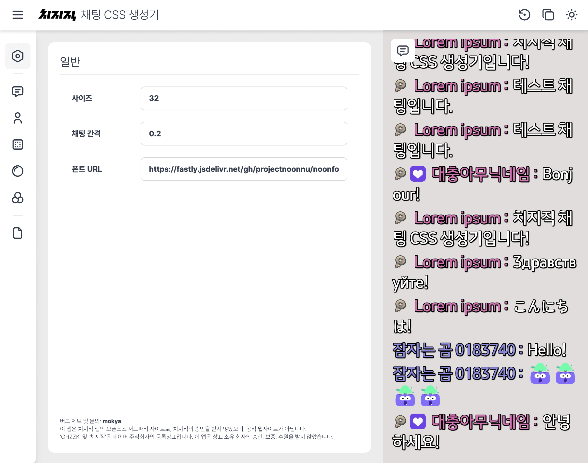

# Chzzk CSS Generator

Simple CSS generator for Chzzk chat overlay.

## Preview


## Features
- Text size, spacing, color
- Nickname line break, color, and disabled
- Chat background (container)
- Text outline
- Chat effects (fade-in)

## Developing
```bash
# Install dependencies
pnpm install

# start development server
pnpm run dev
```
